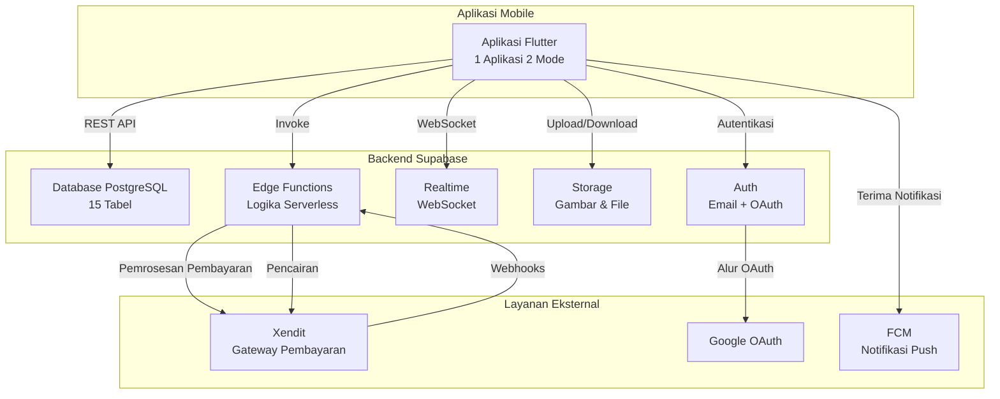

# Dokumen Desain - Platform Marketplace JASAne

## Ikhtisar

JASAne adalah platform marketplace mobile-first yang menghubungkan pengguna dengan penyedia jasa rumah tangga lokal (mitra) melalui sistem pemesanan instan. Platform ini menghilangkan alur kerja persetujuan tradisional dengan menerapkan penguncian slot otomatis setelah konfirmasi pembayaran, menciptakan pengalaman pengguna yang mulus sambil mempertahankan akuntabilitas melalui sistem penalti komprehensif dan perlindungan escrow 24 jam.

### Prinsip Desain Utama

1. **Arsitektur Pemesanan Instan**: Tidak ada state persetujuan tertunda - pemesanan dikonfirmasi segera setelah pembayaran
2. **Pendekatan Keamanan Utama**: Kebijakan Row Level Security (RLS) menerapkan akses data di tingkat database
3. **Komunikasi Real-Time**: Supabase Realtime untuk pembaruan langsung dan chat berbasis WebSocket
4. **Mobile Offline-First**: Caching lokal dengan kemampuan sinkronisasi untuk data pengguna kritis
5. **Clean Architecture**: Pemisahan tanggung jawab yang jelas di lapisan Presentation, Domain, dan Data
6. **Logika Bisnis Serverless**: Edge Functions menangani operasi kritis di sisi server

### Stack Teknologi

- **Framework Mobile**: Flutter 3.x (Android & iOS)
- **Manajemen State**: Riverpod 2.x
- **Platform Backend**: Supabase (PostgreSQL, Edge Functions, Realtime, Storage)
- **Gateway Pembayaran**: Xendit (QRIS, transfer bank, e-wallet, kartu)
- **Notifikasi Push**: Firebase Cloud Messaging (FCM)
- **Pola Arsitektur**: Clean Architecture dengan organisasi berbasis fitur

### Konteks Sistem



## Arsitektur

### Lapisan Clean Architecture

Aplikasi mengikuti prinsip Clean Architecture dengan tiga lapisan berbeda:

#### 1. Lapisan Presentasi
- **Tanggung Jawab**: Komponen UI, manajemen state, interaksi pengguna
- **Komponen**:
  - **Pages (Halaman)**: Tampilan layar penuh (HomePage, BookingDetailPage, ChatPage)
  - **Widgets**: Komponen UI yang dapat digunakan ulang (ServiceCard, BookingStatusBadge)
  - **Providers**: Provider state dan notifier Riverpod
  - **View Models**: Logika bisnis untuk manajemen state UI

#### 2. Lapisan Domain
- **Tanggung Jawab**: Logika bisnis, entitas, use case
- **Komponen**:
  - **Entities (Entitas)**: Objek bisnis inti (Booking, Mitra, Service)
  - **Use Cases**: Operasi bisnis tanggung jawab tunggal (CreateBooking, CancelBooking)
  - **Repository Interfaces**: Kontrak abstrak untuk akses data
  - **Value Objects**: Primitif domain yang immutable (BookingCode, ServiceProtectionPoints)

#### 3. Lapisan Data
- **Tanggung Jawab**: Akses data, integrasi layanan eksternal
- **Komponen**:
  - **Repository Implementations**: Logika akses data konkret
  - **Data Sources**: Remote (Supabase) dan Lokal (Hive/SharedPreferences)
  - **Models**: Objek transfer data dengan serialisasi JSON
  - **Mappers**: Konversi antara model dan entitas

### Struktur Proyek

```
lib/
├── core/
│   ├── constants/
│   │   ├── app_constants.dart
│   │   ├── api_endpoints.dart
│   │   └── storage_buckets.dart
│   ├── errors/
│   │   ├── failures.dart
│   │   └── exceptions.dart
│   ├── network/
│   │   ├── supabase_client.dart
│   │   └── network_info.dart
│   ├── utils/
│   │   ├── date_formatter.dart
│   │   ├── currency_formatter.dart
│   │   └── validators.dart
│   └── theme/
│       ├── app_theme.dart
│       └── app_colors.dart
│
├── features/
│   ├── auth/
│   │   ├── data/
│   │   │   ├── datasources/
│   │   │   │   └── auth_remote_datasource.dart
│   │   │   ├── models/
│   │   │   │   └── user_model.dart
│   │   │   └── repositories/
│   │   │       └── auth_repository_impl.dart
│   │   ├── domain/
│   │   │   ├── entities/
│   │   │   │   └── user.dart
│   │   │   ├── repositories/
│   │   │   │   └── auth_repository.dart
│   │   │   └── usecases/
│   │   │       ├── login_with_email.dart
│   │   │       ├── login_with_google.dart
│   │   │       └── logout.dart
│   │   └── presentation/
│   │       ├── pages/
│   │       │   ├── login_page.dart
│   │       │   └── register_page.dart
│   │       ├── providers/
│   │       │   └── auth_provider.dart
│   │       └── widgets/
│   │           └── login_form.dart
│   │
│   ├── booking/
│   │   ├── data/
│   │   ├── domain/
│   │   └── presentation/
│   │
│   ├── mitra/
│   │   ├── data/
│   │   ├── domain/
│   │   └── presentation/
│   │
│   ├── payment/
│   │   ├── data/
│   │   ├── domain/
│   │   └── presentation/
│   │
│   ├── chat/
│   │   ├── data/
│   │   ├── domain/
│   │   └── presentation/
│   │
│   └── admin/
│       ├── data/
│       ├── domain/
│       └── presentation/
│
└── main.dart
```

### Arsitektur Routing Berbasis Peran

Aplikasi mengimplementasikan arsitektur "1 Aplikasi, 2 Mode" dimana routing ditentukan oleh peran pengguna:

```dart
// Strategi Routing
enum UserRole { user, mitra, admin }

class AppRouter {
  static Route<dynamic> generateRoute(RouteSettings settings, UserRole role) {
    switch (role) {
      case UserRole.user:
        return _userRoutes(settings);
      case UserRole.mitra:
        return _mitraRoutes(settings);
      case UserRole.admin:
        return _adminRoutes(settings);
    }
  }
  
  static Route _userRoutes(RouteSettings settings) {
    // Rute khusus pengguna: beranda, pencarian, pemesanan, chat
  }
  
  static Route _mitraRoutes(RouteSettings settings) {
    // Rute khusus mitra: dashboard, jadwal, pendapatan
  }
  
  static Route _adminRoutes(RouteSettings settings) {
    // Rute khusus admin: verifikasi, sengketa, analitik
  }
}
```

**Penanganan Transisi Peran**:
- Dengarkan perubahan profil pengguna via Supabase Realtime
- Deteksi perubahan peran dalam 5 detik
- Navigasi ke dashboard yang sesuai
- Bersihkan stack navigasi untuk mencegah akses tidak sah


## Komponen dan Antarmuka

### Manajemen State dengan Riverpod

Aplikasi menggunakan Riverpod 2.x untuk manajemen state dengan pemisahan yang jelas antar provider:

#### Tipe Provider

**1. State Providers** - Penyimpan state sederhana
```dart
final userRoleProvider = StateProvider<UserRole>((ref) => UserRole.user);
```

**2. StateNotifier Providers** - State kompleks dengan logika bisnis
```dart
class BookingNotifier extends StateNotifier<AsyncValue<List<Booking>>> {
  final BookingRepository _repository;
  
  BookingNotifier(this._repository) : super(const AsyncValue.loading());
  
  Future<void> loadBookings() async {
    state = const AsyncValue.loading();
    state = await AsyncValue.guard(() => _repository.getUserBookings());
  }
}

final bookingProvider = StateNotifierProvider<BookingNotifier, AsyncValue<List<Booking>>>((ref) {
  return BookingNotifier(ref.watch(bookingRepositoryProvider));
});
```

**3. FutureProvider** - Pengambilan data asinkron
```dart
final mitraProfileProvider = FutureProvider.family<MitraProfile, String>((ref, mitraId) async {
  final repository = ref.watch(mitraRepositoryProvider);
  return repository.getMitraProfile(mitraId);
});
```

**4. StreamProvider** - Stream data real-time
```dart
final chatMessagesProvider = StreamProvider.family<List<Message>, String>((ref, roomId) {
  final repository = ref.watch(chatRepositoryProvider);
  return repository.watchMessages(roomId);
});
```

### Antarmuka Inti

#### Antarmuka Repository

```dart
// Repository Autentikasi
abstract class AuthRepository {
  Future<Either<Failure, User>> loginWithEmail(String email, String password);
  Future<Either<Failure, User>> loginWithGoogle();
  Future<Either<Failure, void>> logout();
  Future<Either<Failure, User>> getCurrentUser();
  Stream<AuthState> get authStateChanges;
}

// Repository Pemesanan
abstract class BookingRepository {
  Future<Either<Failure, Booking>> createBooking(CreateBookingParams params);
  Future<Either<Failure, List<Booking>>> getUserBookings();
  Future<Either<Failure, Booking>> getBookingById(String bookingId);
  Future<Either<Failure, void>> cancelBooking(String bookingId, String reason);
  Future<Either<Failure, void>> updateBookingStatus(String bookingId, BookingStatus status);
  Stream<Booking> watchBooking(String bookingId);
}

// Repository Pembayaran
abstract class PaymentRepository {
  Future<Either<Failure, Payment>> createPayment(String bookingId);
  Future<Either<Failure, Payment>> getPaymentByBookingId(String bookingId);
  Future<Either<Failure, void>> processWebhook(Map<String, dynamic> payload);
}

// Repository Mitra
abstract class MitraRepository {
  Future<Either<Failure, List<Mitra>> searchNearbyMitra(double lat, double lng, double radius);
  Future<Either<Failure, MitraProfile>> getMitraProfile(String mitraId);
  Future<Either<Failure, void>> updateMitraProfile(MitraProfile profile);
  Future<Either<Failure, List<TimeSlot>>> getAvailableSlots(String mitraId, DateTime date);
}

// Repository Chat
abstract class ChatRepository {
  Future<Either<Failure, ChatRoom>> getChatRoom(String bookingId);
  Future<Either<Failure, void>> sendMessage(String roomId, String content, MessageType type);
  Stream<List<Message>> watchMessages(String roomId);
  Future<Either<Failure, void>> markAsRead(String messageId);
}
```

### Supabase Edge Functions

Edge Functions menangani logika bisnis kritis di sisi server untuk memastikan keamanan dan konsistensi:

#### 1. Fungsi Buat Pemesanan
```typescript
// supabase/functions/create-booking/index.ts
import { serve } from "https://deno.land/std@0.168.0/http/server.ts"
import { createClient } from '@supabase/supabase-js'

serve(async (req) => {
  const { services, scheduled_at, address, latitude, longitude } = await req.json()
  
  // Validasi ketersediaan slot
  const isAvailable = await checkSlotAvailability(mitraId, scheduled_at)
  if (!isAvailable) {
    return new Response(JSON.stringify({ error: 'Slot tidak tersedia' }), { status: 400 })
  }
  
  // Hitung harga
  const subtotal = calculateSubtotal(services)
  const platformFee = subtotal * 0.10
  const totalAmount = subtotal + platformFee
  
  // Hasilkan kode booking
  const bookingCode = generateBookingCode()
  
  // Buat pemesanan dengan transaksi
  const booking = await createBookingTransaction({
    booking_code: bookingCode,
    user_id: userId,
    mitra_id: mitraId,
    status: 'terjadwal',
    scheduled_at,
    address,
    latitude,
    longitude,
    subtotal,
    platform_fee: platformFee,
    total_amount: totalAmount,
    commission_rate: 10.00
  })
  
  // Buat invoice Xendit
  const payment = await createXenditInvoice(booking.id, totalAmount)
  
  return new Response(JSON.stringify({ booking, payment }), { status: 200 })
})
```

#### 2. Handler Webhook Pembayaran
```typescript
// supabase/functions/xendit-webhook/index.ts
serve(async (req) => {
  const payload = await req.json()
  
  // Verifikasi tanda tangan webhook
  const isValid = verifyXenditSignature(req.headers, payload)
  if (!isValid) {
    return new Response('Tanda tangan tidak valid', { status: 401 })
  }
  
  // Tangani idempotency
  const existingPayment = await getPaymentByXenditId(payload.id)
  if (existingPayment && existingPayment.status === 'paid') {
    return new Response('Sudah diproses', { status: 200 })
  }
  
  if (payload.status === 'PAID') {
    await updatePaymentStatus(payload.external_id, {
      status: 'paid',
      paid_at: new Date(),
      xendit_payment_id: payload.id,
      xendit_raw: payload
    })
    
    await updateBookingStatus(payload.external_id, 'terjadwal')
    await sendNotification(userId, 'payment_success', payload.external_id)
  }
  
  return new Response('OK', { status: 200 })
})
```

#### 3. Fungsi Batalkan Pemesanan
```typescript
// supabase/functions/cancel-booking/index.ts
serve(async (req) => {
  const { booking_id, cancelled_by, cancel_reason } = await req.json()
  
  const booking = await getBooking(booking_id)
  
  // Hitung pengembalian dana berdasarkan kebijakan pembatalan
  const refundPercentage = calculateRefundPercentage(booking.scheduled_at, cancelled_by)
  const refundAmount = booking.total_amount * (refundPercentage / 100)
  
  // Perbarui pemesanan
  await updateBooking(booking_id, {
    status: cancelled_by === 'user' ? 'dibatalkan_pelanggan' : 'dibatalkan_mitra',
    cancelled_by,
    cancel_reason,
    cancelled_at: new Date(),
    refund_percentage: refundPercentage,
    refund_amount: refundAmount
  })
  
  // Proses pengembalian dana jika berlaku
  if (refundAmount > 0) {
    await createXenditRefund(booking.payment.xendit_payment_id, refundAmount)
  }
  
  // Terapkan penalti jika mitra yang membatalkan
  if (cancelled_by === 'mitra') {
    await applyMitraPenalty(booking.mitra_id, booking_id, 'cancel', 10)
  }
  
  // Lepaskan slot
  await releaseSlot(booking.mitra_id, booking.scheduled_at)
  
  // Kirim notifikasi
  await sendCancellationNotifications(booking, cancelled_by)
  
  return new Response(JSON.stringify({ success: true }), { status: 200 })
})
```

#### 4. Fungsi Pelepasan Escrow
```typescript
// supabase/functions/release-escrow/index.ts
// Berjalan terjadwal setiap jam
serve(async (req) => {
  const now = new Date()
  
  // Temukan pendapatan yang siap dilepaskan
  const pendingEarnings = await supabase
    .from('mitra_earnings')
    .select('*')
    .eq('status', 'pending')
    .eq('is_disputed', false)
    .lte('escrow_release_at', now.toISOString())
  
  for (const earning of pendingEarnings.data) {
    await supabase
      .from('mitra_earnings')
      .update({ status: 'available' })
      .eq('id', earning.id)
    
    await sendNotification(earning.mitra_id, 'earnings_available', earning.id)
    await createAuditLog('escrow_release', earning.id)
  }
  
  return new Response(JSON.stringify({ processed: pendingEarnings.data.length }), { status: 200 })
})
```

### Komunikasi Real-Time

#### Langganan Supabase Realtime

```dart
class ChatRealtimeService {
  final SupabaseClient _supabase;
  
  Stream<List<Message>> watchMessages(String roomId) {
    return _supabase
        .from('messages')
        .stream(primaryKey: ['id'])
        .eq('room_id', roomId)
        .order('created_at')
        .map((data) => data.map((json) => Message.fromJson(json)).toList());
  }
  
  Stream<Booking> watchBooking(String bookingId) {
    return _supabase
        .from('bookings')
        .stream(primaryKey: ['id'])
        .eq('id', bookingId)
        .map((data) => Booking.fromJson(data.first));
  }
}
```

### Integrasi Firebase Cloud Messaging

```dart
class FCMService {
  final FirebaseMessaging _fcm = FirebaseMessaging.instance;
  
  Future<void> initialize() async {
    // Minta izin
    await _fcm.requestPermission();
    
    // Dapatkan token FCM
    final token = await _fcm.getToken();
    await _saveTokenToDatabase(token);
    
    // Tangani refresh token
    _fcm.onTokenRefresh.listen(_saveTokenToDatabase);
    
    // Tangani pesan foreground
    FirebaseMessaging.onMessage.listen(_handleForegroundMessage);
    
    // Tangani pesan background
    FirebaseMessaging.onBackgroundMessage(_handleBackgroundMessage);
    
    // Tangani ketukan notifikasi
    FirebaseMessaging.onMessageOpenedApp.listen(_handleNotificationTap);
  }
  
  void _handleNotificationTap(RemoteMessage message) {
    final data = message.data;
    final type = data['type'];
    final bookingId = data['booking_id'];
    
    // Navigasi berdasarkan tipe notifikasi
    switch (type) {
      case 'booking_new':
      case 'booking_confirmed':
        navigatorKey.currentState?.pushNamed('/booking-detail', arguments: bookingId);
        break;
      case 'message_received':
        navigatorKey.currentState?.pushNamed('/chat', arguments: bookingId);
        break;
    }
  }
}
```

### Integrasi Pembayaran

#### Antarmuka Layanan Xendit

```dart
class XenditService {
  final String _apiKey;
  final Dio _dio;
  
  Future<XenditInvoice> createInvoice({
    required String externalId,
    required double amount,
    required String payerEmail,
    required String description,
  }) async {
    final response = await _dio.post(
      'https://api.xendit.co/v2/invoices',
      data: {
        'external_id': externalId,
        'amount': amount,
        'payer_email': payerEmail,
        'description': description,
        'currency': 'IDR',
        'invoice_duration': 86400, // 24 jam
        'success_redirect_url': 'jasane://payment-success',
        'failure_redirect_url': 'jasane://payment-failed',
      },
      options: Options(
        headers: {
          'Authorization': 'Basic ${base64Encode(utf8.encode('$_apiKey:'))}',
        },
      ),
    );
    
    return XenditInvoice.fromJson(response.data);
  }
  
  Future<void> createDisbursement({
    required String externalId,
    required double amount,
    required String bankCode,
    required String accountNumber,
    required String accountHolderName,
  }) async {
    await _dio.post(
      'https://api.xendit.co/disbursements',
      data: {
        'external_id': externalId,
        'amount': amount,
        'bank_code': bankCode,
        'account_number': accountNumber,
        'account_holder_name': accountHolderName,
        'description': 'Pencairan pendapatan mitra',
      },
      options: Options(
        headers: {
          'Authorization': 'Basic ${base64Encode(utf8.encode('$_apiKey:'))}',
        },
      ),
    );
  }
}
```


## Model Data

### Entitas Domain Inti

#### Entitas User (Pengguna)
```dart
class User {
  final String id;
  final String fullName;       // Nama lengkap
  final String? phone;         // Telepon
  final String? avatarUrl;     // URL avatar
  final UserRole role;         // Peran
  final String? fcmToken;      // Token FCM
  final bool isActive;         // Aktif
  final DateTime createdAt;    // Dibuat pada
  final DateTime updatedAt;    // Diperbarui pada
}

enum UserRole { user, mitra, admin }
```

#### Entitas Booking (Pemesanan)
```dart
class Booking {
  final String id;
  final String bookingCode;        // Kode pemesanan
  final String userId;             // ID pengguna
  final String mitraId;            // ID mitra
  final BookingStatus status;      // Status
  final DateTime scheduledAt;      // Dijadwalkan pada
  final DateTime? startedAt;       // Dimulai pada
  final DateTime? completedAt;     // Diselesaikan pada
  final String address;            // Alamat
  final double? latitude;          // Lintang
  final double? longitude;         // Bujur
  final String? notes;             // Catatan
  final double subtotal;           // Subtotal
  final double platformFee;        // Biaya platform
  final double totalAmount;        // Jumlah total
  final double commissionRate;     // Tarif komisi
  final String? paymentMethod;     // Metode pembayaran
  final String? cancelledBy;       // Dibatalkan oleh
  final String? cancelReason;      // Alasan pembatalan
  final DateTime? cancelledAt;     // Dibatalkan pada
  final double? refundAmount;      // Jumlah pengembalian dana
  final double? refundPercentage;  // Persentase pengembalian dana
  final String? noShowPhotoUrl;    // URL foto no-show
  final DateTime? noShowTimestamp;  // Timestamp no-show
  final double? noShowCompensation; // Kompensasi no-show
  final String? completionPhotoUrl; // URL foto penyelesaian
  final DateTime? autoCompleteAt;   // Auto-selesai pada
  final DateTime createdAt;         // Dibuat pada
  final DateTime updatedAt;         // Diperbarui pada
  
  // Relasi
  final List<BookingItem> items;    // Item pemesanan
  final Payment? payment;           // Pembayaran
  final MitraProfile? mitra;        // Profil mitra
  
  bool get canBeCancelled => status == BookingStatus.terjadwal;  // Dapat dibatalkan
  bool get isCompleted => status == BookingStatus.selesai;        // Sudah selesai
  bool get isCancelled => status == BookingStatus.dibatalkanPelanggan || 
                          status == BookingStatus.dibatalkanMitra; // Sudah dibatalkan
}

enum BookingStatus {
  terjadwal,           // Terjadwal
  berlangsung,         // Berlangsung
  selesai,             // Selesai
  dibatalkanPelanggan, // Dibatalkan pelanggan
  dibatalkanMitra,     // Dibatalkan mitra
  noShow               // Tidak hadir
}
```

#### Entitas MitraProfile (Profil Mitra)
```dart
class MitraProfile {
  final String id;
  final String userId;                    // ID pengguna
  final String? bio;                      // Bio
  final String? ktpUrl;                   // URL KTP
  final bool isVerified;                  // Terverifikasi
  final DateTime? verificationAt;         // Diverifikasi pada
  final String? verifiedBy;               // Diverifikasi oleh
  final double ratingAvg;                 // Rata-rata rating
  final int totalOrders;                  // Total pesanan
  final double completionRate;            // Tingkat penyelesaian
  final int serviceProtectionPoints;      // Poin Perlindungan Layanan
  final int yearsActive;                  // Tahun aktif
  final String? bankName;                 // Nama bank
  final String? bankAccount;              // Rekening bank (Terenkripsi)
  final String? bankHolder;               // Pemegang rekening
  final double? latitude;                 // Lintang
  final double? longitude;                // Bujur
  final int serviceRadius;                // Radius layanan
  final String? city;                     // Kota
  final String? province;                 // Provinsi
  final bool isAvailable;                 // Tersedia
  final DateTime createdAt;               // Dibuat pada
  final DateTime updatedAt;               // Diperbarui pada
  
  // Relasi
  final List<MitraService> services;      // Layanan
  final List<MitraSchedule> schedules;    // Jadwal
  
  bool get canAcceptBookings => isVerified && isAvailable && serviceProtectionPoints >= 50;
  // Dapat menerima pemesanan jika terverifikasi, tersedia, dan SP >= 50
  
  bool get needsAttention => serviceProtectionPoints < 70;
  // Perlu perhatian jika SP < 70
}
```

#### Entitas Payment (Pembayaran)
```dart
class Payment {
  final String id;
  final String bookingId;              // ID pemesanan
  final String? xenditInvoiceId;       // ID invoice Xendit
  final String? xenditPaymentId;       // ID pembayaran Xendit
  final double amount;                 // Jumlah
  final String currency;               // Mata uang
  final String? method;                // Metode
  final PaymentStatus status;          // Status
  final String? invoiceUrl;            // URL invoice
  final DateTime? paidAt;              // Dibayar pada
  final DateTime? expiredAt;           // Kedaluwarsa pada
  final Map<String, dynamic>? xenditRaw; // Data mentah Xendit
  final DateTime createdAt;            // Dibuat pada
  final DateTime updatedAt;            // Diperbarui pada
  
  bool get isPaid => status == PaymentStatus.paid;       // Sudah dibayar
  bool get isExpired => status == PaymentStatus.expired;  // Sudah kedaluwarsa
  bool get isPending => status == PaymentStatus.pending;  // Menunggu
}

enum PaymentStatus { pending, paid, failed, expired, refunded }
// pending = menunggu, paid = dibayar, failed = gagal, expired = kedaluwarsa, refunded = dikembalikan
```

#### Entitas MitraService (Layanan Mitra)
```dart
class MitraService {
  final String id;
  final String mitraId;            // ID mitra
  final String categoryId;         // ID kategori
  final String name;               // Nama
  final String? description;       // Deskripsi
  final double price;              // Harga
  final PriceUnit priceUnit;       // Satuan harga
  final int? durationMinutes;      // Durasi (menit)
  final bool isActive;             // Aktif
  final DateTime createdAt;        // Dibuat pada
  final DateTime updatedAt;        // Diperbarui pada
  
  // Relasi
  final Category? category;        // Kategori
  
  String get formattedPrice {
    final formatter = NumberFormat.currency(locale: 'id_ID', symbol: 'Rp ', decimalDigits: 0);
    return formatter.format(price);
  }
}

enum PriceUnit { perJob, perHour, perUnit, estimate }
// perJob = per pekerjaan, perHour = per jam, perUnit = per unit, estimate = estimasi
```

#### Entitas MitraSchedule (Jadwal Mitra)
```dart
class MitraSchedule {
  final String id;
  final String mitraId;              // ID mitra
  final int dayOfWeek;               // Hari dalam seminggu (0=Minggu, 6=Sabtu)
  final TimeOfDay openTime;          // Waktu buka
  final TimeOfDay closeTime;         // Waktu tutup
  final int slotDurationMinutes;     // Durasi slot (menit)
  final int maxSlotsPerDay;          // Maks slot per hari
  final bool isActive;               // Aktif
  
  int get totalSlotsAvailable {
    // Hitung total slot tersedia
    final openMinutes = openTime.hour * 60 + openTime.minute;
    final closeMinutes = closeTime.hour * 60 + closeTime.minute;
    final totalMinutes = closeMinutes - openMinutes;
    return (totalMinutes / slotDurationMinutes).floor();
  }
  
  List<TimeSlot> generateTimeSlots(DateTime date) {
    // Hasilkan slot waktu untuk tanggal tertentu
    final slots = <TimeSlot>[];
    var currentTime = DateTime(date.year, date.month, date.day, openTime.hour, openTime.minute);
    final endTime = DateTime(date.year, date.month, date.day, closeTime.hour, closeTime.minute);
    
    while (currentTime.isBefore(endTime)) {
      slots.add(TimeSlot(
        startTime: currentTime,
        endTime: currentTime.add(Duration(minutes: slotDurationMinutes)),
        isAvailable: true,
      ));
      currentTime = currentTime.add(Duration(minutes: slotDurationMinutes));
    }
    
    return slots;
  }
}
```

#### Entitas Message (Pesan)
```dart
class Message {
  final String id;
  final String roomId;         // ID ruang chat
  final String senderId;       // ID pengirim
  final String? content;       // Konten
  final MessageType type;      // Tipe
  final String? imageUrl;      // URL gambar
  final bool isRead;           // Sudah dibaca
  final DateTime createdAt;    // Dibuat pada
}

enum MessageType { text, image, system }
// text = teks, image = gambar, system = sistem
```

#### Entitas MitraEarnings (Pendapatan Mitra)
```dart
class MitraEarnings {
  final String id;
  final String mitraId;                    // ID mitra
  final String bookingId;                  // ID pemesanan
  final double grossAmount;                // Jumlah bruto
  final double commission;                 // Komisi
  final double netAmount;                  // Jumlah bersih
  final EarningsStatus status;             // Status
  final DateTime? escrowReleaseAt;         // Pelepasan escrow pada
  final bool isDisputed;                   // Disengketakan
  final DateTime? disputeResolvedAt;       // Sengketa diselesaikan pada
  final DateTime? disbursedAt;             // Dicairkan pada
  final String? xenditDisbursementId;      // ID pencairan Xendit
  final DateTime createdAt;                // Dibuat pada
  
  bool get isAvailableForWithdrawal => status == EarningsStatus.available && !isDisputed;
  // Tersedia untuk penarikan jika status available dan tidak disengketakan
  
  bool get isInEscrow => status == EarningsStatus.pending;
  // Dalam escrow jika status pending
}

enum EarningsStatus { pending, available, disbursed }
// pending = menunggu, available = tersedia, disbursed = dicairkan
```

### Value Objects (Objek Nilai)

#### Value Object BookingCode (Kode Pemesanan)
```dart
class BookingCode {
  final String value;
  
  BookingCode._(this.value);
  
  factory BookingCode.generate() {
    final now = DateTime.now();
    final dateStr = DateFormat('yyyyMMdd').format(now);
    final random = Random().nextInt(9999).toString().padLeft(4, '0');
    return BookingCode._('JSN-$dateStr-$random');
  }
  
  factory BookingCode.fromString(String value) {
    if (!_isValid(value)) {
      throw ArgumentError('Format kode booking tidak valid');
    }
    return BookingCode._(value);
  }
  
  static bool _isValid(String value) {
    final regex = RegExp(r'^JSN-\d{8}-\d{4}$');
    return regex.hasMatch(value);
  }
}
```

#### Value Object ServiceProtectionPoints (Poin Perlindungan Layanan)
```dart
class ServiceProtectionPoints {
  final int value;
  
  ServiceProtectionPoints(this.value) {
    if (value < 0 || value > 100) {
      throw ArgumentError('Poin Perlindungan Layanan harus antara 0 dan 100');
    }
  }
  
  ServiceProtectionPoints deduct(int points) {
    return ServiceProtectionPoints(max(0, value - points));
  }
  
  ServiceProtectionPoints add(int points) {
    return ServiceProtectionPoints(min(100, value + points));
  }
  
  bool get isHealthy => value >= 70;       // Sehat
  bool get needsAttention => value >= 50 && value < 70;  // Perlu perhatian
  bool get isCritical => value < 50;       // Kritis
  
  String get statusLabel {
    if (isHealthy) return 'Sangat Baik';
    if (needsAttention) return 'Cukup';
    return 'Kritis';
  }
}
```

### Ringkasan Skema Database

Platform menggunakan 15 tabel PostgreSQL di Supabase:

1. **users** - Akun pengguna yang memperluas Supabase auth
2. **mitra_profiles** - Profil penyedia jasa
3. **mitra_penalties** - Sistem pelacakan penalti
4. **categories** - Kategori layanan
5. **mitra_services** - Layanan yang ditawarkan mitra
6. **mitra_schedules** - Jadwal ketersediaan mingguan
7. **mitra_blocked_dates** - Tanggal tidak tersedia
8. **bookings** - Record pemesanan inti
9. **booking_items** - Item baris per pemesanan
10. **payments** - Transaksi pembayaran via Xendit
11. **mitra_earnings** - Pendapatan dengan sistem escrow
12. **reviews** - Ulasan dan rating pelanggan
13. **chat_rooms** - Ruang chat per pemesanan
14. **messages** - Pesan real-time
15. **notifications** - Log notifikasi push
16. **app_settings** - Konfigurasi sistem
17. **audit_logs** - Jejak audit


### Kebijakan Row Level Security (RLS)

Semua tabel mengimplementasikan kebijakan RLS untuk menerapkan kontrol akses data di tingkat database:

#### RLS Tabel Users
```sql
-- Pengguna dapat membaca profil mereka sendiri
CREATE POLICY "Users can read own profile"
ON users FOR SELECT
USING (auth.uid() = id);

-- Pengguna dapat memperbarui profil mereka sendiri
CREATE POLICY "Users can update own profile"
ON users FOR UPDATE
USING (auth.uid() = id);
```

#### RLS Tabel Bookings
```sql
-- Pengguna dapat membaca pemesanan mereka sendiri
CREATE POLICY "Users can read own bookings"
ON bookings FOR SELECT
USING (auth.uid() = user_id);

-- Mitra dapat membaca pemesanan yang ditugaskan kepada mereka
CREATE POLICY "Mitra can read assigned bookings"
ON bookings FOR SELECT
USING (
  auth.uid() IN (
    SELECT user_id FROM mitra_profiles WHERE id = bookings.mitra_id
  )
);

-- Hanya Edge Functions yang dapat membuat pemesanan
CREATE POLICY "Only Edge Functions can create bookings"
ON bookings FOR INSERT
WITH CHECK (auth.jwt()->>'role' = 'service_role');
```

#### RLS Tabel Mitra Earnings
```sql
-- Mitra hanya dapat membaca pendapatan mereka sendiri
CREATE POLICY "Mitra can read own earnings"
ON mitra_earnings FOR SELECT
USING (
  auth.uid() IN (
    SELECT user_id FROM mitra_profiles WHERE id = mitra_earnings.mitra_id
  )
);

-- Hanya Edge Functions yang dapat memodifikasi pendapatan
CREATE POLICY "Only Edge Functions can modify earnings"
ON mitra_earnings FOR ALL
USING (auth.jwt()->>'role' = 'service_role');
```

#### RLS Tabel Messages
```sql
-- Pengguna dapat membaca pesan di ruang chat mereka
CREATE POLICY "Users can read own messages"
ON messages FOR SELECT
USING (
  room_id IN (
    SELECT id FROM chat_rooms 
    WHERE user_id = auth.uid() OR mitra_id IN (
      SELECT id FROM mitra_profiles WHERE user_id = auth.uid()
    )
  )
);

-- Pengguna dapat mengirim pesan di ruang chat mereka
CREATE POLICY "Users can send messages"
ON messages FOR INSERT
WITH CHECK (
  sender_id = auth.uid() AND
  room_id IN (
    SELECT id FROM chat_rooms 
    WHERE user_id = auth.uid() OR mitra_id IN (
      SELECT id FROM mitra_profiles WHERE user_id = auth.uid()
    )
  )
);
```


## Penanganan Error

### Arsitektur Error

Aplikasi mengimplementasikan strategi penanganan error komprehensif menggunakan pola monad Either dari paket `dartz`:

```dart
abstract class Failure {
  final String message;   // Pesan
  final String? code;     // Kode
  
  const Failure(this.message, [this.code]);
}

// Kegagalan Jaringan
class ServerFailure extends Failure {
  const ServerFailure(String message, [String? code]) : super(message, code);
}

class NetworkFailure extends Failure {
  const NetworkFailure(String message) : super(message);
}

// Kegagalan Autentikasi
class AuthenticationFailure extends Failure {
  const AuthenticationFailure(String message, [String? code]) : super(message, code);
}

class UnauthorizedFailure extends Failure {
  const UnauthorizedFailure(String message) : super(message);
}

// Kegagalan Logika Bisnis
class ValidationFailure extends Failure {
  const ValidationFailure(String message) : super(message);
}

class BookingFailure extends Failure {
  const BookingFailure(String message, [String? code]) : super(message, code);
}

class PaymentFailure extends Failure {
  const PaymentFailure(String message, [String? code]) : super(message, code);
}

// Kegagalan Data
class CacheFailure extends Failure {
  const CacheFailure(String message) : super(message);
}

class NotFoundFailure extends Failure {
  const NotFoundFailure(String message) : super(message);
}
```

### Pesan Error Ramah Pengguna

```dart
class ErrorMessageMapper {
  static String getUserFriendlyMessage(Failure failure) {
    if (failure is NetworkFailure) {
      return 'Tidak ada koneksi internet. Periksa koneksi Anda dan coba lagi.';
    }
    
    if (failure is AuthenticationFailure) {
      return 'Email atau password salah. Silakan coba lagi.';
    }
    
    if (failure is BookingFailure) {
      if (failure.code == 'slot_unavailable') {
        return 'Slot waktu tidak tersedia. Silakan pilih waktu lain.';
      }
      if (failure.code == 'mitra_unavailable') {
        return 'Mitra sedang tidak tersedia. Silakan pilih mitra lain.';
      }
      return 'Gagal membuat booking. ${failure.message}';
    }
    
    if (failure is PaymentFailure) {
      if (failure.code == '402') {
        return 'Saldo tidak mencukupi. Silakan gunakan metode pembayaran lain.';
      }
      return 'Pembayaran gagal. ${failure.message}';
    }
    
    if (failure is ValidationFailure) {
      return failure.message;
    }
    
    return 'Terjadi kesalahan. Silakan coba lagi.';
  }
}
```

### Logika Retry (Percobaan Ulang)

```dart
class RetryPolicy {
  static Future<T> retry<T>({
    required Future<T> Function() operation,
    int maxAttempts = 3,           // Maks percobaan
    Duration delay = const Duration(seconds: 1),  // Jeda
    bool Function(dynamic error)? retryIf,        // Coba ulang jika
  }) async {
    int attempts = 0;
    
    while (true) {
      try {
        return await operation();
      } catch (e) {
        attempts++;
        
        if (attempts >= maxAttempts) {
          rethrow;
        }
        
        if (retryIf != null && !retryIf(e)) {
          rethrow;
        }
        
        await Future.delayed(delay * attempts);
      }
    }
  }
}
```

### Respons Error Edge Function

```typescript
// Format respons error standar
interface ErrorResponse {
  error: {
    code: string;      // Kode
    message: string;   // Pesan
    details?: any;     // Detail
  };
}

function errorResponse(code: string, message: string, details?: any): Response {
  return new Response(
    JSON.stringify({
      error: { code, message, details }
    }),
    {
      status: getStatusCode(code),
      headers: { 'Content-Type': 'application/json' }
    }
  );
}

function getStatusCode(code: string): number {
  switch (code) {
    case 'VALIDATION_ERROR': return 400;   // Error validasi
    case 'UNAUTHORIZED': return 401;        // Tidak terautentikasi
    case 'FORBIDDEN': return 403;           // Dilarang
    case 'NOT_FOUND': return 404;           // Tidak ditemukan
    case 'CONFLICT': return 409;            // Konflik
    case 'RATE_LIMIT': return 429;          // Batas laju
    default: return 500;                    // Error server
  }
}
```


## Strategi Pengujian

### Pendekatan Pengujian

Platform JASAne mengimplementasikan strategi pengujian komprehensif di berbagai lapisan:

1. **Unit Test** - Test komponen individual, use case, dan logika bisnis
2. **Widget Test** - Test komponen UI Flutter secara terisolasi
3. **Integration Test** - Test alur fitur end-to-end
4. **Edge Function Test** - Test logika bisnis serverless
5. **Manual Testing** - Test skenario dunia nyata dengan perangkat aktual

### Target Cakupan Test

- **Unit Test**: Cakupan kode minimum 80%
- **Widget Test**: Semua widget dan halaman yang dapat digunakan ulang
- **Integration Test**: Alur pengguna kritis (pemesanan, pembayaran, pembatalan)
- **Edge Functions**: Cakupan 90% untuk logika bisnis

### Alat Pengujian

- **flutter_test**: Framework pengujian bawaan Flutter
- **mockito**: Mocking dependensi
- **integration_test**: Pengujian end-to-end
- **deno test**: Pengujian Edge Function
- **coverage**: Pelaporan cakupan kode

### Checklist Pengujian Manual

#### Pengujian Alur Pengguna
- [ ] Registrasi dan login pengguna
- [ ] Pencarian mitra terdekat
- [ ] Lihat profil dan layanan mitra
- [ ] Pilih slot waktu dan buat pemesanan
- [ ] Selesaikan pembayaran via Xendit
- [ ] Terima konfirmasi pemesanan
- [ ] Chat dengan mitra
- [ ] Batalkan pemesanan dengan pengembalian dana
- [ ] Beri rating dan ulasan mitra

#### Pengujian Alur Mitra
- [ ] Registrasi mitra dengan unggah KTP
- [ ] Proses verifikasi admin
- [ ] Buat dan kelola layanan
- [ ] Konfigurasi jadwal ketersediaan
- [ ] Blokir tanggal tertentu
- [ ] Terima dan mulai pemesanan
- [ ] Unggah foto penyelesaian
- [ ] Laporkan no-show dengan bukti GPS
- [ ] Lihat pendapatan dan minta pencairan

#### Pengujian Alur Admin
- [ ] Review permintaan verifikasi mitra
- [ ] Setujui/tolak profil mitra
- [ ] Tangani penyelesaian sengketa
- [ ] Kelola kategori layanan
- [ ] Konfigurasi pengaturan sistem
- [ ] Lihat log audit

#### Pengujian Kasus Tepi
- [ ] Perilaku mode offline
- [ ] Gangguan jaringan selama pembayaran
- [ ] Percobaan pemesanan bersamaan pada slot yang sama
- [ ] Penanganan retry webhook pembayaran
- [ ] Pelepasan escrow otomatis
- [ ] Refresh token FCM
- [ ] Transisi peran selama sesi aktif

### Pengujian Kinerja

- **Load Testing**: Simulasi 1000 pengguna bersamaan
- **Stress Testing**: Test batas sistem
- **Kinerja Kueri Database**: Pastikan kueri dieksekusi di bawah 100ms
- **Waktu Respons API**: Target < 500ms untuk persentil ke-95
- **Latensi Pesan Real-time**: Target < 200ms

### Pengujian Keamanan

- [ ] Kebijakan RLS mencegah akses data tidak sah
- [ ] Validasi token JWT
- [ ] Verifikasi tanda tangan webhook
- [ ] Pencegahan injeksi SQL
- [ ] Pencegahan XSS dalam pesan chat
- [ ] Penyimpanan rekening bank terenkripsi
- [ ] Pembatasan laju pada endpoint autentikasi
